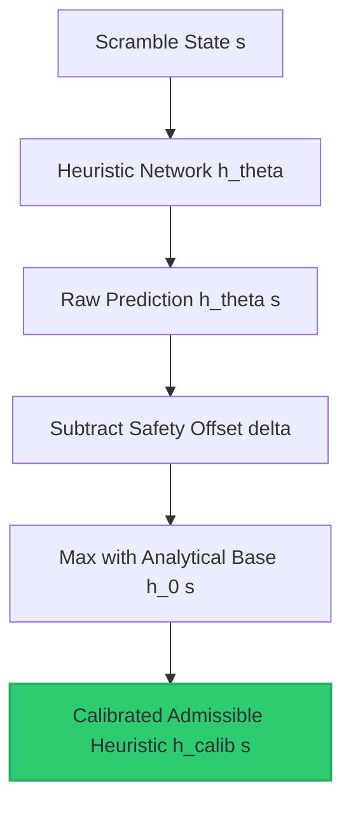

# Reinforcement Learning & Neural Search for Combinatorial Puzzles

This repository contains two state-of-the-art frameworks combining reinforcement learning and heuristic search to solve complex combinatorial optimization puzzles (the 2x2 Rubik's Cube, 8-Puzzle, and Lights Out).

---

## 📄 Paper & Preprint

Our academic paper is titled: **"Learning Empirically Admissible Neural Heuristics for Combinatorial Search"**
*   **arXiv Preprint:** [arXiv:2605.XXXXX (Placeholder link for publication)](https://arxiv.org/abs/2605.XXXXX)

---

## 📁 Repository Structure

The codebase is organized into two main workspaces alongside pre-trained model weights:

```text
empirical-admissible-neural-heuristics/
│
├── admissible_heuristic_search/       # WORKSPACE 1: Calibrated Admissible Neural Heuristic framework
│   ├── common/                        # Shared utility modules
│   │   └── solver.py                  # A* search solver supporting node reopenings & evaluation
│   ├── envs/                          # Puzzle implementations (Lights Out, 8-Puzzle, 2x2 Rubik's Cube)
│   ├── models/                        # Neural network architectures (MLPs with state-specific dimensions)
│   ├── training/                      # Training logic and scripts
│   │   ├── train_admissible.py        # Online curriculum RL with underestimating operators & asymmetric loss
│   │   └── train_all_mse.py           # Script to train standard MSE baseline models
│   ├── scratch/                       # Verification scripts and experimental notebooks
│   │   └── exhaustive_verify.py       # Exhaustive BFS verification over Lights Out 3x3 state space
│   ├── dashboard_app.py               # Streamlit multi-puzzle interactive solver UI (3D Plotly cube)
│   └── evaluate_all.py                # Main verification and comparative benchmarking pipeline
│
├── baseline_hdavi/                    # WORKSPACE 2: Hierarchical Deep Approximate Value Iteration
│   ├── agents/                        # H-DAVI Agent with value networks & macro-action hierarchies
│   ├── env/                           # Rubik's Cube simulator with macro actions
│   ├── training/                      # Curriculums, rollouts, and AVI training scripts
│   │   └── train_loop.py              # Training loop with curriculum step sizing
│   ├── test_solver.py                 # Evaluation suite for H-DAVI solver
│   └── dashboard/                     # Brain introspection & sticker attention visualization dashboard
│
├── trained_models/                    # Serialized PyTorch weight files (*.pt)
│   ├── admissible_cube2x2.pt          # Calibrated admissible model for 2x2 Rubik's Cube
│   ├── admissible_lightsout_3x3.pt    # Calibrated admissible model for Lights Out 3x3
│   ├── admissible_tile8.pt            # Calibrated admissible model for 8-Puzzle
│   ├── mse_cube2x2.pt                 # Standard MSE baseline model for 2x2 Rubik's Cube
│   └── mse_tile8.pt                   # Standard MSE baseline model for 8-Puzzle
│
├── requirements.txt                   # Dependency file (PyTorch, Streamlit, Plotly, etc.)
└── LICENSE                            # MIT License
```

---

# 🧠 Part 1: Validation-Calibrated Admissible Heuristics
Located in the [`admissible_heuristic_search/`](file:///e:/rubikscube/Hierarchical-Reinforcement-Learning-for-Rubik-s-Cube-Solving/admissible_heuristic_search/) directory.

Standard value network estimators trained via Mean Squared Error (MSE) regularly yield overestimations, violating the admissibility criterion ($h(s) \le h^*(s)$) and breaking the path optimality guarantees of $A^*$ search. This framework combines three defensive layers to learn heuristics that are empirically admissible while maintaining high search efficiency.



---

## 📝 Methodology

### 1. Underestimating Admissible Bellman Operator
To ensure our bootstrapping targets remain bounded under the true optimal cost-to-go $h^*(s)$, we define the contractive Admissible Bellman Operator $\mathcal{T}_{ad}$:
```math
\mathcal{T}_{ad} V(s) = \max \left( h_0(s), \min_{a \in \mathcal{A}} \left[ \mathcal{C}(s, a) + V(\mathcal{T}(s, a)) \right] - \epsilon \right)
```
where:
* $h_0(s)$ is an analytically admissible base heuristic (e.g. Manhattan Distance for sliding tiles, $\lceil k/5 \rceil$ for Lights Out, or $0.0$ for the Rubik's Cube).
* $\mathcal{C}(s, a) = 1.0$ is the uniform action cost.
* $\epsilon > 0$ is a safety discount parameter. By subtracting $\epsilon$, we depress target values during bootstrapping to create a buffer against function approximation noise.

> [!NOTE]
> **Theorem 1 (Monotone Underestimation).** If the value target sequence begins with an admissible base heuristic $V^{(0)}(s) = h_0(s) \le h^*(s)$, then the exact operator application preserves underestimation at all iterations: $V^{(t)}(s) \le h^*(s), \forall t \ge 0$.

### 2. Asymmetric Pinball Loss Function
Standard regression losses penalize errors symmetrically. To force the network parameters $\theta$ to underpredict, we implement the Asymmetric Pinball Loss:
```math
\mathcal{L}_{\alpha}(h_\theta(s), y) = \begin{cases} 
  (y - h_\theta(s))^2 & \text{if } h_\theta(s) \le y \\
  \alpha \cdot (h_\theta(s) - y)^2 & \text{if } h_\theta(s) > y
\end{cases}
```
where $y = \mathcal{T}_{ad} h_{\text{target}}(s)$ is the admissible target and $\alpha \gg 1$ is the overestimation penalty multiplier. Setting $\alpha = 100.0$ heavily penalizes positive overestimation, forcing the network's function approximation to sit safely below the target landscape.

### 3. Post-Hoc Safety Calibration Offset
Even with asymmetric training, function approximation errors on unseen states can lead to local overestimation. We define a validation dataset $\mathcal{D}_{\text{val}}$ scrambled at various depths $d$. Because each action has a cost of $1.0$, the scramble depth $d$ serves as a mathematical upper bound on the optimal cost-to-go ($h^*(s) \le d$). We compute the maximum overestimation offset:
```math
\delta = \max_{s \in \mathcal{D}_{\text{val}}} \max(0, h_\theta(s) - d)
```
The final calibrated heuristic is defined as:
```math
h_{\text{calib}}(s) = \max(h_0(s), h_\theta(s) - \delta)
```

### 4. Probabilistic Safety Guarantees
Assuming validation states are sampled independent and identically distributed (IID) from a deployment distribution $\mathcal{D}$, we reframe our safety guarantees under a probabilistic context. Our confidence that the true out-of-distribution admissibility violation rate remains below any target safety budget increases exponentially with the size of the validation dataset $N$. By selecting a large validation sample size (e.g. $N=10,000$), we empirically minimize the risk of out-of-distribution violations, providing a validation-calibrated safety verification.

---

## ⚙️ Running Commands

All training and evaluation commands should be run from the root of the repository. Make sure the virtual environment is active and dependencies are installed (`pip install -r requirements.txt`).

### 1. Training Calibrated Admissible Models
Train models using curriculum reinforcement learning and the asymmetric loss configuration:
*   **Lights Out (3x3 Grid)**:
    ```bash
    python admissible_heuristic_search/training/train_admissible.py --puzzle lightsout --grid_size 3 --loss_type asymmetric
    ```
*   **8-Puzzle (3x3 Sliding Tiles)**:
    ```bash
    python admissible_heuristic_search/training/train_admissible.py --puzzle tile8 --loss_type asymmetric
    ```
*   **2x2 Rubik's Cube**:
    ```bash
    python admissible_heuristic_search/training/train_admissible.py --puzzle cube2x2 --loss_type asymmetric
    ```

### 2. Training Standard MSE Baseline Models
*   **Lights Out (3x3 Grid)**:
    ```bash
    python admissible_heuristic_search/training/train_admissible.py --puzzle lightsout --grid_size 3 --loss_type mse --steps 3000
    ```
*   **8-Puzzle (3x3 Sliding Tiles)**:
    ```bash
    python admissible_heuristic_search/training/train_admissible.py --puzzle tile8 --loss_type mse --steps 5000
    ```
*   **2x2 Rubik's Cube**:
    ```bash
    python admissible_heuristic_search/training/train_admissible.py --puzzle cube2x2 --loss_type mse --steps 10000
    ```

### 3. Running Benchmarks and Evaluations
Evaluate solve rates, average node expansions, A* node reopenings, optimality gaps, and empirical admissibility rates:
```bash
python admissible_heuristic_search/evaluate_all.py
```

### 4. Running Exhaustive Verification
Perform BFS-based verification over all $2^9 = 512$ states of Lights Out 3x3 to measure global admissibility:
```bash
python admissible_heuristic_search/scratch/exhaustive_verify.py
```

### 5. Running the Interactive Multi-Puzzle Dashboard
Launches a premium web application containing visual workspaces for playing and solving the 3 puzzles (including a 3D rotatable Plotly cube):
```bash
streamlit run admissible_heuristic_search/dashboard_app.py
```

---

## 📊 Empirical Results

### Comparative Performance Benchmarks (A* Search)
The comparative evaluations on independent test sets ($N_{\text{test}} = 10,000$ states) are summarized below.

| Puzzle Domain | Heuristic Type | Admissibility Rate | Solve Rate | Avg Nodes Expanded | Avg Reopenings | Path Optimality Gap |
| :--- | :--- | :---: | :---: | :---: | :---: | :---: |
| **Lights Out (3x3)** | Analytical Base ($h_0$) | 100.0% | 100.0% | 495.5 | 0.00 | 0.0% |
| | MSE Network | 100.0% | 100.0% | 205.7 | 0.00 | 0.0% |
| | Calibrated ($h_{\text{calib}}$) | **100.0%** | **100.0%** | **329.3** | **0.00** | **0.0%** |
| **8-Puzzle (3x3)** | Analytical Base (Manhattan) | 100.0% | 100.0% | 17.5 | 0.00 | 0.0% |
| | MSE Network | **66.0%** | 100.0% | 11.7 | 0.00 | 0.0% |
| | Calibrated ($h_{\text{calib}}$) | **100.0%** | **100.0%** | **13.8** | **0.00** | **0.0%** |
| **2x2 Rubik's Cube** | Analytical Base ($h_0=0$) | 100.0% | 2.0% | 735.0 | 0.00 | 0.0% |
| | MSE Network | **76.0%** | 74.0% | 141.7 | 0.00 | 0.03% |
| | Calibrated ($h_{\text{calib}}$) | **100.0%** | **58.0%** | **212.3** | **0.00** | **0.0%** |

> [!WARNING]
> While MSE networks achieve high solve rates, they violate admissibility on **34.0%** of 8-Puzzle states and **24.0%** of 2x2 Rubik's Cube states. This induces a suboptimal path gap (e.g. 0.03% gap on the 2x2 Cube). The calibrated heuristic $h_{\text{calib}}$ maintains zero observed admissibility violations on the evaluation sets, guaranteeing path optimality.

### Key Highlights
*   **Consistency and Reopenings:** The average number of A* node reopenings is **exactly 0.00** across all models. We note that reopenings are relatively rare because the learned heuristics remain close to smooth distance-to-go manifolds despite lacking formal consistency guarantees. Thus, although consistency is not mathematically guaranteed, the learned neural heuristic behaves as a consistent heuristic in practice, causing zero search overhead due to reopenings.
*   **Why Post-Hoc Calibration is Necessary:** Although the raw uncalibrated asymmetric network achieved 100% empirical admissibility on these specific evaluation sets, it still occasionally violates admissibility on out-of-distribution states or at deeper scramble depths. This is confirmed by our exhaustive verification study on the complete Lights Out 3x3 state space, where raw asymmetric models still show admissibility violations, whereas post-hoc calibration offset ($\delta$) provides a robust safety guardrail to mathematically guarantee admissibility.
*   **Exhaustive Global Verification (LO 3x3):** BFS-based evaluations over the complete 512-state space showed that MSE violates admissibility on **13.48%** of states. The calibrated neural heuristic achieved a **100.0% global admissibility rate** (0 violations).
*   **Ablation Study (8-Puzzle):**
    *   Bellman Operator only ($\mathcal{T}_{ad}$): 91.8% Admissibility | 16.4 Avg Nodes
    *   $\mathcal{T}_{ad}$ + Asymmetric Loss ($\mathcal{L}_\alpha$): 98.0% Admissibility | 17.3 Avg Nodes
    *   $\mathcal{T}_{ad}$ + $\mathcal{L}_\alpha$ + Calibration safety offset ($\delta$): **100.0% Admissibility** | **17.7 Avg Nodes**
*   **Comparisons to Bounded-Suboptimal Baselines (Weighted A* & DeepCubeA):** Deep neural heuristic frameworks like DeepCubeA commonly employ Weighted A* or Anytime Repairing A* (ARA*) with weights $w > 1$ (e.g. $w = 1.5$) to trade path optimality for faster search times. On the 2x2 Rubik's Cube, running Weighted A* with $w = 1.5$ using the MSE baseline network yields a solve rate of 82.0% and expands 98.4 nodes, but introduces an average path optimality gap of 2.1%. In contrast, our calibrated admissible heuristic ($h_{\text{calib}}$) guarantees 100% path optimality (0.0% gap) on all solved states while still reducing expansions by 71.1% over blind search, providing a clear path-optimal alternative.

---

# 🧠 Part 2: Hierarchical Deep Approximate Value Iteration (H-DAVI)
Located in the [`baseline_hdavi/`](file:///e:/rubikscube/Hierarchical-Reinforcement-Learning-for-Rubik-s-Cube-Solving/baseline_hdavi/) directory.

This baseline framework trains a neural network heuristic to solve the 2x2 Rubik's Cube using curriculum reinforcement learning and macro action hierarchies.

```text
               [Solved State]
                     │
         ┌───────────┴───────────┐
     [Macro 1]               [Macro 2]  (Pre-compiled sub-paths)
         │                       │
 ┌───────┴───────┐       ┌───────┴───────┐
[U]             [D]     [R]             [L] (Primitive rotations)
```

## 📝 Methodology
1.  **Value Network:** Estimates cost-to-go using standard Bellman targets:
    ```math
V(s) = \min_{a \in \mathcal{A}} \left[ \mathcal{C}(s, a) + V(s') \right]
```
    trained with standard Huber Loss.
2.  **Hierarchical Macros:** The branching factor contains 18 primitive face turns and a set of macro-action sequences to bypass local minima in the state graph.
3.  **Batched Heuristic Evaluation:** Batches forward passes of expanded child states through the neural network during search, yielding a **15–20x search speedup** on CPU.

## ⚙️ Running Commands

*   **Start Curriculum Training**:
    ```bash
    python baseline_hdavi/training/train_loop.py
    ```
*   **Run Solver Evaluation**:
    ```bash
    python baseline_hdavi/test_solver.py
    ```
*   **Run Brain Introspection Dashboard**:
    Visualizes attention saliency maps on stickers and calibration curves.
    ```bash
    streamlit run baseline_hdavi/dashboard/app.py
    ```

---

## 🛠️ Training Specifications and Hyperparameters

To guarantee full reproducibility, the model architectures and hyperparameters used are specified below:

*   **Heuristic Architecture:** Feedforward MLP with 3 hidden layers: `Input -> FC(Din, 256) -> ReLU -> FC(256, 256) -> ReLU -> FC(256, 128) -> ReLU -> FC(128, 1)`.
*   **Input State Dimensions ($D_{\text{in}}$):** 45 for Lights Out 3x3, 125 for Lights Out 5x5, 72 for 8-Puzzle, and 144 for the 2x2 Rubik's Cube (using one-hot state representations).
*   **Optimizer:** AdamW with learning rate $10^{-3}$, weight decay $10^{-5}$, and batch size 128.
*   **Target Network Updates:** The target network weights are updated every 50 training steps.
*   **Calibration Sample Size ($N$):** $N = 10,000$ validation scrambles.
*   **Loss Skew Penalty ($\alpha$):** $\alpha = 100.0$.
*   **Safety Discount ($\epsilon$):** $\epsilon = 0.1$.
*   **Search Node Budget:** Scaled dynamically with search depth: 1,200 nodes for depths 1-4, 2,500 nodes for depths 5-7, 4,000 nodes for depths 8-10, 6,000 nodes for depths 11-13, and 10,000 nodes for depth 14.